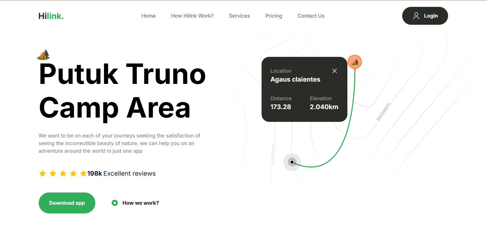

# 🌍 Travel UI/UX Design – Tailwind Practice Project

This is a clean, responsive, and modern travel-themed UI/UX website built with **Next.js** and **Tailwind CSS**. It was developed as a front-end design practice project focused on improving layout structure, component reusability, and styling with utility-first CSS.

 <!-- Replace with actual screenshot path -->

---

## 🚀 Features

- 🌐 Fully responsive layout for all screen sizes
- 🎨 UI designed using Tailwind's utility classes
- 🔁 Reusable components (Navbar, Footer, Hero, Cards, etc.)
- 📱 Mobile-friendly menu with toggle animation
- 🎯 Minimal, travel-focused design aesthetic
- ⚡ Fast performance with optimized Next.js rendering

---

## 📂 Project Structure

travel-ui-design/
├── components/ # Reusable UI components (Navbar, Footer, Cards, etc.)
├── pages/ # Next.js routing pages
├── public/ # Static assets (images, icons, etc.)
├── styles/ # Global CSS if needed
├── tailwind.config.js
└── README.md

yaml
Copy code

---

## 🛠️ Tech Stack

- **Framework:** [Next.js](https://nextjs.org/)
- **Styling:** [Tailwind CSS](https://tailwindcss.com/)
- **Icons & Assets:** SVGs and free-use travel images
- **Deployment:** [Vercel](https://vercel.com)

---

## 📦 Getting Started

### Clone the repo:
```bash
git clone https://github.com/Keshav325/travel-ui-design.git
cd travel-ui-design
Install dependencies:
bash
Copy code
npm install
Run development server:
bash
Copy code
npm run dev
The app will be available at http://localhost:3000

✅ What I Practiced
Mastery of Tailwind CSS utility classes

Component-based architecture in React/Next.js

Mobile-first responsive design

Clean UI layout for real-world use cases

📸 Demo
Live Demo: https://travel-ui-design.vercel.app

🙋‍♂️ Author
Keshav Jha
📫 keshavjha122006@gmail.com
🌐 Portfolio (Coming Soon)

📄 License
This project is open source and available under the MIT License.

vbnet
Copy code

Let me know if you'd like:
- Custom badges
- A walkthrough GIF or screenshot
- A section like “Future Improvements” or “Known Issues”